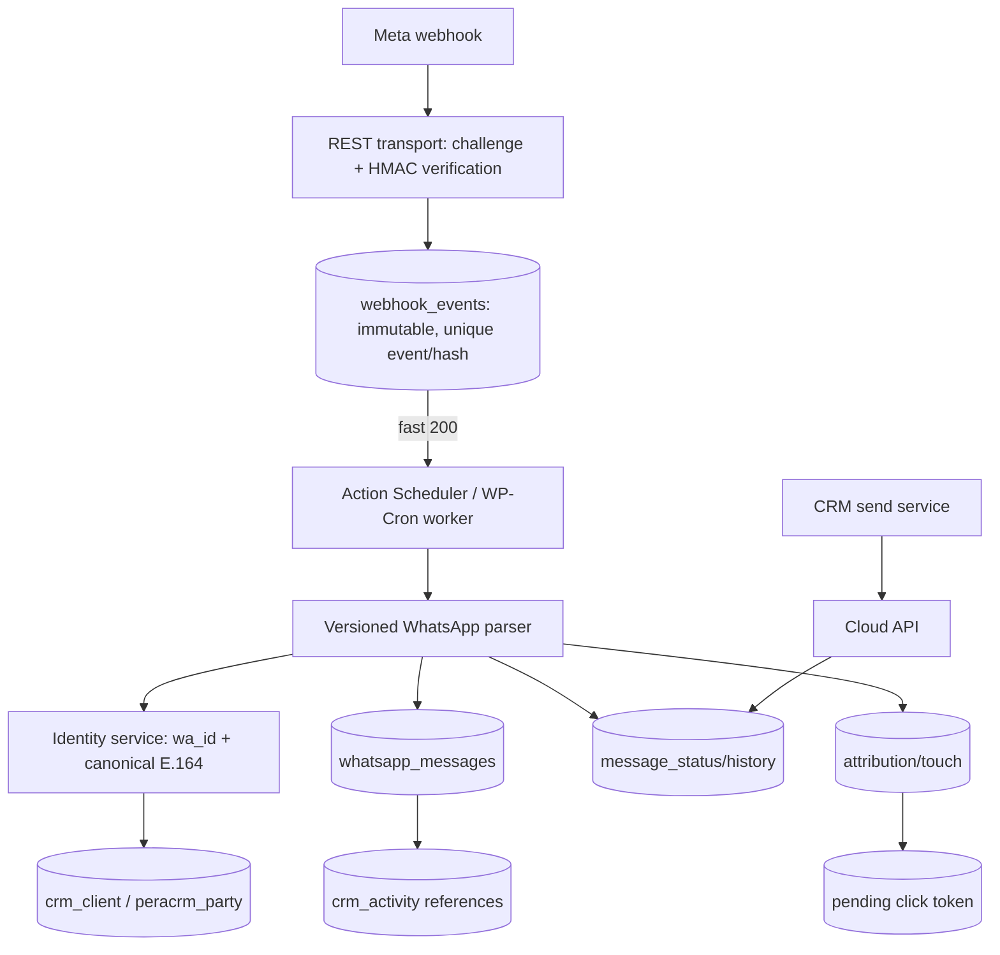
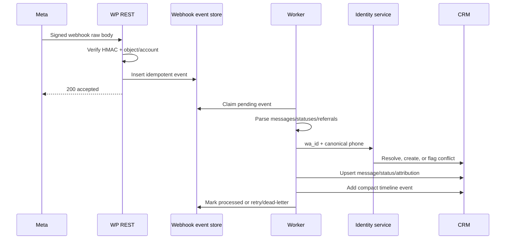

# WhatsApp–Pera CRM Integration: Technical Audit and Implementation Plan

**Audit date:** 2026-08-29

**Scope:** repository analysis and recommendations only; no runtime behaviour is changed by this document.
**Primary code reviewed:** `wp-content/plugins/peracrm`, `wp-content/plugins/pera-portal`, the active child theme, and repository-wide WhatsApp, attribution, CRM-ingest, REST, AJAX, activity, analytics, and background-job references.

> **Important baseline correction:** this repository is not merely at “website click logging.” It already contains an **inbound-only, early-stage WhatsApp Cloud API implementation** in PeraCRM: a public REST webhook, settings UI, message table, phone matching, automatic client creation, activity writes, and enquiry notifications. It is incomplete and unsafe to enable as a production integration without the hardening and redesign below. All statements labelled **Current** describe checked-in code; all statements labelled **Recommendation** are proposed future work.

## 1. Executive Summary

Pera currently has three distinct WhatsApp concerns that are only loosely connected:

1. **Website click-to-WhatsApp:** the child theme centrally builds most destination URLs with `pera_get_whatsapp_url()` and contextual prefills with `pera_get_whatsapp_context()`. A delegated browser click handler sends an unauthenticated-user-compatible, nonce-protected AJAX event to `pera_log_whatsapp_click_ajax()`, which inserts into `{site_prefix}pera_whatsapp_clicks`.
2. **CRM inbound messages:** PeraCRM registers `GET|POST /wp-json/peracrm/v1/whatsapp/webhook`. `peracrm_whatsapp_process_inbound_payload()` currently parses inbound messages, normalizes a Turkish-centric number, finds or directly creates a `crm_client`, inserts `{crm_prefix}peracrm_whatsapp_messages`, logs activity, and dispatches first-enquiry notifications.
3. **CRM communication/UI:** client screens provide a `wa.me` launch action and timelines, while the WhatsApp admin page provides settings/diagnostics and a recent-message preview. There is no advisor conversation inbox, send-message service, templates UI, media retrieval, status processing, unread state, or assignment/reassignment workflow.

The two storage streams have **no durable correlation key**. Website click rows contain page/property context, prefilled message, referrer, user agent and IP, but no `pera_vid`, session ID, UTM columns, click token, CRM client ID, or WhatsApp sender. Inbound message rows contain the sender and raw webhook subset, but no click ID. Timestamp/message-text/IP inference would be ambiguous and must not be the primary join.

The safest direction is to **harden and refactor the existing PeraCRM REST implementation**, not create a second endpoint. First add signature verification, a durable webhook-event inbox/queue and better idempotency; then route identity resolution through a single client service using canonical E.164 values and database-enforced identity uniqueness. Preserve full message/referral/status semantics in dedicated normalized WhatsApp tables and emit compact references into the existing generic activity timeline.

For website attribution, generate a high-entropy, short-lived, opaque enquiry reference, store it server-side with click/visitor/UTM/property context, and append only that non-sensitive reference to the prefilled message. Resolve it on inbound text and consume it transactionally. Keep probabilistic time matching as an explicitly low-confidence fallback only.

### Immediate blockers

* **BLOCKER — webhook authenticity:** the POST route has `permission_callback => __return_true` and does not verify `X-Hub-Signature-256` with a Meta App Secret.
* **HIGH — premature client creation:** webhook processing is synchronous and creates a client before the message insert. A database error can leave a client with no durable message; concurrent messages from a new number can create duplicate clients because phone identity is not uniquely indexed.
* **HIGH — split client creation:** WhatsApp uses `peracrm_whatsapp_create_client_from_inbound()` (direct `wp_insert_post`) rather than `peracrm_find_or_create_client_by_identity()` / `peracrm_ingest_enquiry()`, bypassing part of the established dedupe/status/property pipeline.
* **HIGH — incomplete event model:** only `messages[]` are handled. Status events, referral/ad metadata, timestamps, context/replies and media metadata/retrieval are not normalized.
* **HIGH — attribution disconnect:** click logs and inbound messages cannot be deterministically joined today.

## 2. Current Architecture

```mermaid
flowchart LR
  Site[Theme pages and CTAs] --> URL[pera_get_whatsapp_url / pera_get_whatsapp_context]
  Site --> JS[Delegated click logger]
  JS --> AJAX[admin-ajax.php\naction=pera_log_whatsapp_click]
  AJAX --> Clicks[(wp_pera_whatsapp_clicks)]
  URL --> WA[WhatsApp client]
  WA -. no correlation key .-> Meta[WhatsApp Cloud API]
  Meta --> REST[/peracrm/v1/whatsapp/webhook]
  REST --> Proc[peracrm_whatsapp_process_inbound_payload]
  Proc --> Msg[(wp_peracrm_whatsapp_messages)]
  Proc --> Client[(crm_client post + postmeta)]
  Proc --> Activity[(wp_crm_activity)]
  Client --> Party[(wp_peracrm_party)]
```

`peracrm.php` defines schema version 16 and loads `inc/bootstrap.php`. The bootstrap loads the WhatsApp core, click-log bridge, message-table installer, notification provider, enquiry ingest, repositories/services, REST modules and timeline code. Schema upgrades are triggered only for authenticated users with `manage_options` or `edit_crm_clients`; therefore a fresh deployment must run an authorized request/activation path before Meta delivery is expected.

PeraCRM is multisite-aware through `peracrm_with_target_blog()` and `peracrm_table()`. The webhook wraps processing in the target-blog helper. In contrast, the child-theme click logger uses the current request blog’s `$wpdb->prefix`; the CRM log reader contains target-blog bridging. Deployment must confirm these resolve to the intended databases.

### Pera Portal finding

`wp-content/plugins/pera-portal` has no CRM enquiry ingestion or Cloud API integration. Its portal shell renders a share button and compiled `assets/dist/portal-viewer.js` opens `https://wa.me/?text=<current share URL>`. This is generic user sharing (no configured business recipient, tracking AJAX, property CRM link, or attribution), so it must remain distinct from lead CTAs unless product requirements deliberately change it.

## 3. Existing WhatsApp Tracking

### URL/button generation

* `wp-content/themes/hello-elementor-child/inc/whatsapp-helpers.php`
  * `pera_get_default_whatsapp_number()` hard-codes fallback `905452054356`.
  * `pera_get_whatsapp_number()` reads option `pera_whatsapp_number`, strips non-digits, and falls back.
  * `pera_get_whatsapp_url($message)` centrally builds `https://wa.me/{number}?text={encoded message}`.
* `wp-content/themes/hello-elementor-child/inc/whatsapp.php`
  * `pera_get_current_request_url()`, `pera_get_property_reference()` and `pera_get_whatsapp_context()` choose page type and prefill. Property references are the property post ID; property prefills include title, reference and URL.
  * `pera_floating_whatsapp_button()` renders the global CTA and tracking data attributes. It is suppressed/replaced by a CRM shortcut for authorized users on CRM routes.
* Additional theme templates render CTAs and should be inventoried before implementation with `rg -n "pera_get_whatsapp_url|data-whatsapp|wa\.me" wp-content/themes/hello-elementor-child`. Not every raw/share URL necessarily participates in tracking.
* `wp-content/plugins/peracrm/inc/helpers.php::peracrm_whatsapp_url_from_phone()` builds the advisor-facing CRM client link from phone digits.
* `wp-content/plugins/pera-portal/templates/portal-shell.php` plus compiled `assets/dist/portal-viewer.js` implement untracked WhatsApp sharing.

### Browser/AJAX event path

`wp-content/themes/hello-elementor-child/inc/modules/enqueue-assets.php` creates nonce `pera_whatsapp_click`, localizes the AJAX configuration, and enqueues `js/whatsapp-click-log.js`; that legacy file is intentionally a no-op because the active delegated dispatcher is in `js/main.js`. The dispatcher identifies WhatsApp anchors/data attributes, reads the destination/prefill/page fields, and sends `action=pera_log_whatsapp_click` with `navigator.sendBeacon()` or a `fetch()` fallback. The element can also declare `data-track-ga4-event="whatsapp_click"` and `data-track-crm-event="whatsapp_click"`. When the consent-controlled globals exist, `main.js` emits GA4 `whatsapp_click` through `gtag()` and Meta Pixel custom event `WhatsAppLead` through `fbq()`.

Server hooks in `wp-content/themes/hello-elementor-child/inc/whatsapp-click-log.php` are:

* `wp_ajax_pera_log_whatsapp_click`
* `wp_ajax_nopriv_pera_log_whatsapp_click`
* callback `pera_log_whatsapp_click_ajax()`
* normalization `pera_whatsapp_normalize_payload()`
* insert `pera_whatsapp_clicks_insert()`

The public AJAX action requires a WordPress nonce but has no rate limit. The server derives IP from `REMOTE_ADDR` and may fall back to `HTTP_REFERER`; it accepts/sanitizes the browser-supplied page and tracking fields.

### Click table (Current)

Physical name is the current site prefix plus `pera_whatsapp_clicks`, returned by `pera_whatsapp_clicks_table_name()`. Version `1.1.0` is installed by `after_switch_theme` and `init` using `dbDelta()`.

| Column | Current meaning |
|---|---|
| `id` | auto-increment click row ID |
| `created_at` | DB insertion time |
| `page_type` | allow-listed contextual type; otherwise `generic` |
| `page_url` | current/browser URL |
| `post_id`, `post_title` | page/property post context when supplied |
| `message_text` | WhatsApp prefill visible to the user |
| `referrer` | browser/server referrer |
| `user_agent`, `ip_address` | request metadata (PII/privacy impact) |
| `whatsapp_type` | CTA variant |
| `track_intent`, `track_source`, `track_context` | declared UI metadata |
| `link_href` | clicked destination |
| `event_source`, `crm_event` | declared analytics/event names |

Indexes exist on `created_at`, `page_type`, and `post_id`. There are **no** client, phone, `wa_id`, visitor/session, language, advisor, campaign, UTM, `fbclid`, `gclid`, click-token or conversion columns. Query-string UTMs can incidentally survive inside `page_url` or `referrer`; that is not structured capture. The separate analytics module creates a `pera_vid` cookie and analytics tables, but the WhatsApp logger does not read/store that visitor ID, so the systems are not joined.

The CRM reads click rows via `wp-content/plugins/peracrm/inc/whatsapp-logs.php` and renders them at `/crm/whatsapp-logs/` (`inc/frontend/routing.php`, `inc/views/pages/crm-logs.php`) and the admin menu. Access is capability-gated and list/delete AJAX actions use nonce `peracrm_whatsapp_logs`. This UI is separate from Cloud API message storage.

## 4. CRM Client/Data Model

### Identity and storage (Current)

Clients are private `crm_client` posts registered by `peracrm_register_cpt_crm_client()` with WordPress post ID as the primary client/party ID. `post_title` is the display name; most fields live in postmeta and coexist in canonical/legacy pairs:

| Concern | Current fields/storage |
|---|---|
| Name | `post_title`, `crm_first_name`, `crm_last_name` |
| Phone | `_peracrm_phone`, legacy `crm_phone` |
| Email | `_peracrm_email`, `crm_primary_email`, `primary_email`, normalized variants |
| Source/status | `crm_source`, legacy `crm_status`, `_peracrm_status`; pipeline status is primarily `{prefix}peracrm_party` |
| Advisor | `assigned_advisor_user_id`, legacy `crm_assigned_advisor`; helpers reconcile divergence |
| User relationship | `linked_user_id` and WP user meta `crm_client_id` |
| Country/language/marketing | various postmeta/form raw fields; no repository-wide normalized client attribution entity |
| Timestamps | WordPress `post_date`/`post_modified`; party/deal tables have their own timestamps |

`{prefix}peracrm_party` uses `party_id` (same client post ID) and holds `lead_pipeline_stage`, `engagement_state`, `disposition`, `lead_stage_updated_at`, `updated_at`. `{prefix}peracrm_deals` holds opportunities, owner and commission data. `{prefix}crm_client_property` uniquely links `(client_id, property_id, relation_type)`.

### Phone handling and duplicate risk

Manual create/edit uses `peracrm_phone_canonical_from_components()` / `peracrm_phone_canonical_from_source()` in `inc/helpers.php`; it concatenates a selected dial code with stripped national digits. General ingest strips formatting but does not globally validate E.164.

WhatsApp separately uses `peracrm_whatsapp_normalize_phone()`. It maps `05xxxxxxxxx`, ten digits, and `90…` to `+90…`, but treats any other unprefixed number as `+{digits}`. This is not a complete international parser and can misinterpret numbers without country context. `peracrm_whatsapp_phone_match_candidates()` searches exact forms in `_peracrm_phone` and `crm_phone`; it creates Turkish local variants only. Phone postmeta has no uniqueness constraint.

Email ingest has stronger dedupe: `peracrm_find_or_create_client_by_email()` finds all matching email variants, chooses a canonical published/newest record, marks duplicates with `peracrm_dedupe_canonical_id`, and trashes duplicates. Phone-only `peracrm_find_or_create_client_by_identity()` calls `peracrm_find_existing_client_id_by_phone()` and returns the first exact match; it neither canonicalizes all legacy representations nor merges multiple matches.

There is no general-purpose merge service that migrates activities, notes, reminders, deals, properties and WhatsApp rows. Therefore automatic merging must not be improvised during webhook delivery.

### Safest creation entry point

**Recommendation:** refactor and harden `peracrm_find_or_create_client_by_identity()` as the single identity resolver, then have WhatsApp call it (or call a new application service built around it). Use `peracrm_ingest_enquiry()` for first-message lead semantics/property linking/notifications, but add a channel-aware mode so it does not duplicate the already-stored WhatsApp activity. Do **not** continue with direct `peracrm_whatsapp_create_client_from_inbound()`: it duplicates creation, source, status and advisor logic and does not initialize `{prefix}peracrm_party` itself.

Existing create paths include frontend POST routing in `inc/frontend/routing.php`, theme enquiry capture through `peracrm_ingest_enquiry()`, Facebook Lead Ads ingestion in `inc/integrations/facebook-leads/ingest.php`, admin actions/import, and the WordPress REST exposure inherited from `show_in_rest => true`. The generic PeraCRM REST controller in `inc/rest.php` primarily supplies protected CRM operations; webhook delivery should remain a purpose-built REST route, not admin AJAX.

## 5. CRM Activity Architecture

Current tables created in `inc/schema.php`:

* `{prefix}crm_activity`: `id`, `client_id`, `event_type`, JSON `event_payload`, `created_at`; indexed by client/time and type/time.
* `{prefix}crm_notes`: advisor-authored long text, visibility and timestamp.
* `{prefix}crm_reminders`: advisor, due/status/note and timestamps.
* `{prefix}crm_client_property`: property relationships.

`peracrm_log_event()` / `peracrm_log_event_result()` and `peracrm_activity_log()` write generic events through repository functions. `inc/admin/metaboxes/timeline.php`, `inc/frontend-data/crm-client-view.php`, and `inc/views/pages/crm-client.php` format the unified client timeline. Capture hooks in `inc/activity-capture.php` add property views, account visits and logins. Enquiries include page URL, post/property ID, message, referrer, user agent, IP, source identifiers and raw fields in activity payload JSON.

Current inbound WhatsApp processing adds:

* `whatsapp_inbound` for every newly inserted message, containing message ID/type/preview/phone/message-row ID;
* `client_created` inside the direct creator;
* `lead_created` and `enquiry` only when that webhook created the client.

**Recommendation:** keep `crm_activity` as the cross-channel timeline/index, but keep message bodies, delivery transitions, media and reply graph in dedicated WhatsApp tables. One compact activity per meaningful message/conversation event should reference `whatsapp_message_id`/row ID. Storing the entire conversation only as JSON activities would make idempotency, status updates, unread queries, search, retention and outbound reporting expensive and fragile.

## 6. Current Attribution Architecture

Website form ingestion is more attribution-aware than WhatsApp ingestion. `peracrm_ingest_enquiry()` derives source URL and property ID, creates an enquiry fingerprint, logs page/post/property, message, preferred contact, referrer, user agent, IP, multisite IDs, source event ID and sanitized raw fields, and links the property through `peracrm_client_property_link()`.

The theme analytics module (`inc/modules/analytics/tracker.php`, `install.php`, `queries.php`, `source-classification.php`) maintains a `pera_vid` visitor cookie and page/event analytics separately. The click logger does not carry that identifier. CRM display code recognizes `utm_source`, `utm_medium`, and `utm_campaign` when present in raw enquiry data, but the WhatsApp click table has no corresponding columns and inbound handling does not map them.

Consequences:

* Property attribution is available in website click rows and often human-readable in property prefill text, but is not parsed into an inbound client/message.
* Referrer and query-string campaign data may be present in click URLs but are not promoted into CRM source/campaign fields.
* A click cannot subsequently be assigned to a client without guessing.
* IP/user-agent matching across a Meta webhook is impossible: the webhook request comes from Meta, not the visitor.

## 7. Proposed WhatsApp Architecture



### Receiver location and transport

Keep the receiver in PeraCRM (`inc/rest/whatsapp.php`) because it already owns client/message/activity services and uses the target-blog wrapper. REST is correct: Meta requires public GET verification and POST delivery; WordPress AJAX is browser/session-oriented and adds no benefit. Pera Portal should not own this integration.

Split responsibilities into transport, immutable event repository, parser, identity resolver, message repository, attribution resolver, and outbound provider. Return 2xx quickly after authenticating and durably inserting the event. Process asynchronously. A failed worker should retry with capped exponential backoff and a dead-letter/admin diagnostic state.

### Configuration

Current option `peracrm_whatsapp_settings` stores `enabled`, `phone_number_id`, `access_token`, `verify_token`, `graph_api_version`, and `test_mode`; the admin-post save path is in `inc/admin/actions.php` and UI in `inc/admin/pages/whatsapp.php`. It lacks App Secret and WABA ID.

**Recommendation:** allow environment constants/secret-manager injection to override DB values; encrypt DB secrets where operational key management permits; never autoload; never display secrets; record rotation metadata. Add App Secret, WABA ID, business phone ID, environment and API version policy. Verify the webhook payload phone-number ID belongs to the configured account.

### Authenticity, retry and idempotency

* Verify raw request bytes using `hash_hmac('sha256', raw_body, app_secret)` and constant-time comparison to `X-Hub-Signature-256` **before JSON processing**.
* Retain Meta verification-token challenge behavior, but treat it only as subscription verification—not POST authentication.
* Use a unique immutable delivery/event key. Message uniqueness currently relies on nullable `whatsapp_message_id`; status events need their own deterministic key or payload hash plus status/timestamp.
* Current option locks (`peracrm_wa_msg_lock_{md5}`, TTL 120 seconds) reduce simultaneous processing but are not a substitute for transaction-safe identity/message inserts. The unique message-ID index is the final safeguard only for rows with IDs.
* Never perform irreversible client creation before durable webhook acceptance. Workers must be safely repeatable.
* Log event IDs, phases and error codes; exclude access/verify/App secrets and minimize/hash phone/body values in operational logs.

### API limits

Outbound work must centralize Graph calls behind a provider with timeout, retry-after handling, rate/error classification, per-number throttling, template/session-window enforcement, and request/response audit IDs. Do not retry permanent 4xx errors blindly.

## 8. Inbound Message Flow



Current parser supports only `entry[].changes[].value.messages[]`, the first contact profile name, sender, ID, type and text. Non-text becomes `[type]`; `media_url` stays empty. The row timestamp is processing time rather than Meta’s message timestamp. Raw JSON stores the entry/change/message subset. It ignores statuses, errors, metadata IDs, contacts per-message association, message context/replies, referral objects, reactions, locations, contacts payloads, interactive/button/order/system data, and media IDs/captions/mime/hash.

**Recommendation:** parse and retain, where delivered: `wa_id`, display phone, profile name, WAMID, Meta timestamp (UTC), type-specific payload, context/reply WAMID, referral/ad fields, business phone/WABA identifiers and errors. For media, initially persist media ID/mime/hash/caption and fetch with authenticated short-lived URLs into controlled private storage only when needed; never treat Meta media URLs as durable.

Statuses (`sent`, `delivered`, `read`, `failed`, etc.) should update current message state and append immutable status history. Unknown types must remain recoverable from raw events rather than being discarded.

## 9. Automatic Client Creation

Recommended worker flow:

1. Validate `wa_id`/sender and parse a canonical E.164 number using a maintained phone library or rigorously tested country-aware service.
2. Resolve an explicit WhatsApp identity record by `(business_phone_number_id, wa_id)` first; resolve canonical phone second.
3. If exactly one client matches, link it. If multiple clients match, do **not** silently pick the first: place the conversation in a conflict queue for privileged merge/link review.
4. If none matches, call the hardened common identity/client service, initialize party stage, assign according to a configurable routing rule, set source `whatsapp` plus source-detail, and create one lead.
5. Insert/upsert message and attribution within a transaction/compensating workflow; emit timeline activity by message row reference.
6. Update denormalized `last_whatsapp_at`/conversation unread counters only after successful message persistence.

Canonical format should be **E.164 with leading `+`** for CRM display/storage (for example `+905xxxxxxxxx`) plus a digits-only indexed key when needed. Preserve raw sender separately for audit. `05…` must only become `+90…` when country is known or a documented Turkey default applies. Backfill existing `_peracrm_phone`/`crm_phone`, report ambiguous/invalid records, and add identity uniqueness before automatic creation is enabled.

Use `wa_id` as a channel identity, not as a universal assumption that it always equals a callable phone number. Do not overwrite a verified CRM name/email solely from WhatsApp profile data; store profile name at identity/conversation level unless staff confirms it.

## 10. Website Attribution Strategy

### Feasibility today

Deterministic correlation is **not feasible with the current schema**. Exact prefilled message matching is fragile because users can edit/remove it, multiple users can use identical copy, and translations change it. Timestamp proximity can produce false joins. IP/user agent cannot bridge to Meta. Property title/reference parsing is useful as a fallback attribution hint but not a click identity.

### Recommended opaque reference design

1. On CTA activation (or immediately before destination navigation), create a server-side pending attribution row containing a random token hash, click ID, `pera_vid` (subject to consent), landing/current/referrer URLs, normalized UTMs/click IDs, property/post ID, language, CTA context and expiry.
2. Append a short, human-tolerable reference such as `Ref: WA-A7K4Q9` to the prefilled text. The token contains no phone, email, visitor ID, IP, campaign details or other sensitive data.
3. On inbound text, extract the exact reference, hash/lookup it, validate expiry/scope, and atomically consume/link it to message/client.
4. Retain original touch data and confidence/method (`signed_token`, `meta_referral`, `property_text`, `time_window_manual`) rather than overwriting client acquisition fields.
5. If the user removes the reference, show candidate clicks to staff only as low-confidence suggestions; never auto-link solely by time.

Prefer a random opaque token over a self-contained signed payload: it is shorter, revocable, does not disclose encoded context and supports one-time consumption. A signature/HMAC can still protect any structured public reference. Do not silently embed sensitive visitor data.

Token creation must survive popup/navigation timing: use a pre-created URL returned by a same-origin endpoint, `sendBeacon` where appropriate, or a short redirect service. Do not delay the CTA indefinitely if logging fails. Define expiry (for example 7 days based on measured lead latency), multi-click behavior, replay policy and consent basis.

## 11. Meta Click-to-WhatsApp Attribution

Meta-originated conversations may provide a `referral` object with source type/ID/URL and ad/headline/body/media metadata. Preserve the delivered object in the immutable raw event, normalize stable fields into attribution storage, and never infer unavailable campaign/ad-set data. If richer campaign lookup is required, use a separately authorized Marketing API integration with explicit permissions and retention rules.

Recommended source taxonomy:

| Origin | Client acquisition source | Touch detail |
|---|---|---|
| Pera website token resolved | `whatsapp` | `website_click_to_whatsapp`; click/property/UTM reference |
| Meta referral present | `whatsapp` | `meta_click_to_whatsapp`; source/ad/post identifiers |
| No referral/token, first inbound | `whatsapp` | `organic_or_direct` |
| Staff-created/manual referral | existing `referral` or `whatsapp` per reporting decision | `manual_referral`, referrer/advisor |

Do not overload the existing single `crm_source` with every campaign dimension. Set it once as acquisition source according to an agreed first-touch rule, then store multiple immutable attribution touches. Map Meta `source_id` to an external source/ad reference, not automatically to a campaign ID. Store source URL/headline/body as snapshot metadata with length/PII controls.

## 12. Proposed Database/Data Model

Use `peracrm_table()` and PeraCRM schema-version/dbDelta conventions. Exact DDL belongs in a later reviewed migration.

### A. `peracrm_whatsapp_identities` (new)

`id`, `client_id`, `business_phone_number_id`, `wa_id`, `phone_e164`, `phone_digits`, `profile_name`, verification/conflict state, first/last seen timestamps, created/updated timestamps. Unique `(business_phone_number_id, wa_id)` and—after cleanup—an appropriate canonical-phone uniqueness policy.

### B. `peracrm_whatsapp_conversations` (new)

`id`, identity/client/business-number IDs, assigned advisor, state, unread count, first/last inbound/outbound/message timestamps, last message ID, attribution ID, created/updated timestamps. This supports inbox queries without scanning messages.

### C. evolve `peracrm_whatsapp_messages`

Current columns are `id`, nullable `client_id`, required `phone_e164`, profile name, direction/type/body, `media_url`, unique nullable WAMID, raw JSON, source, linked-by and processing `created_at`.

Recommended additions/replacements: conversation/identity IDs; business number ID; Meta `message_timestamp`; `received_at`; `sent_by_user_id`; current status/error; reply/context WAMID; type-specific sanitized JSON; media ID/mime/hash/storage attachment ID; attribution ID; `updated_at`. Keep WAMID unique. Replace durable `media_url` expectations with a controlled storage reference. Raw payload belongs primarily in the event table, not duplicated indefinitely per message.

### D. `peracrm_whatsapp_message_statuses` (new)

Immutable `id`, message/WAMID, status, Meta timestamp, recipient, error code/title/detail, conversation/pricing category where supplied, raw event ID, received timestamp; unique deterministic event key.

### E. `peracrm_whatsapp_webhook_events` (new)

`id`, payload/event hash, object/account/business-number IDs, signature verification result, received/processed timestamps, state, attempts, next attempt, last error code, encrypted/compressed or protected raw JSON, retention expiry. Unique event/hash and indexed queue state.

### F. `peracrm_attribution_touches` and pending tokens (new)

Touch: client/message/click/property IDs, channel, source/detail, campaign/ad/ad-set/post external IDs, UTM/click IDs, source/landing/referrer URLs, language, metadata JSON, confidence/method, occurred/created timestamps. Pending token: token hash, click/touch context, expiry, consumed message/client and timestamps.

### Data placement rules

* **Client:** stable identity/contact, acquisition source summary, assigned advisor, pipeline state; optionally denormalized last WhatsApp contact.
* **Activity:** human timeline event and foreign references; no full mutable message/status document.
* **WhatsApp message:** content/type/direction/reply/media/current status and Meta timestamps.
* **Attribution touch:** immutable origin/campaign/property/click evidence and confidence.
* **Raw webhook event:** authenticated forensic/replay input with short, explicit retention.

No SQL foreign keys are used by current PeraCRM tables; follow that convention initially but implement application-level integrity, indexed IDs, deletion/anonymization services and orphan audits.

## 13. CRM UI Recommendations

The frontend CRM is PHP-rendered under `inc/views/pages/*`, populated by `inc/frontend-data/*`, enhanced by `assets/frontend/crm.js`, and routed by `inc/frontend/routing.php`. The client page already has contact action links, advisor ownership, properties, notes/reminders and a timeline. Admin has a separate client view and WhatsApp settings/message preview.

Recommended incremental placement:

1. **Client header/contact card:** normalized WhatsApp number, channel/source badge, last contact and launch action; search service should query canonical phone/WA identity.
2. **Client page conversation panel:** paginated bubbles, direction/advisor/time/status, safe attachment cards, reply context and attribution banner. Keep generic timeline entries concise.
3. **Global `/crm/whatsapp/` inbox:** role-scoped assigned/unassigned/all filters, unread badge, last preview/time, client/conflict indicator, source/property/ad badges, advisor assignment/reassignment.
4. **Composer (later):** send text, approved templates, attachment constraints, reply selection, session-window/template messaging and clear send errors.
5. **Conflict/review UI:** duplicate identity candidates, manual link/create/merge decision with audit log.

Extend existing PeraCRM capabilities rather than relying only on `manage_options`. Advisors must see/send only scoped conversations; managers can reassign; only administrators can configure secrets/webhooks. Escape message content and never render inbound HTML. Media downloads require capability checks and non-guessable/private delivery.

## 14. Outbound Messaging Options

### Model A — WhatsApp Business App plus CRM sync

Advisors keep mobile/desktop habits while Pera receives synchronized events. Operational adoption is easier, but completeness depends on Meta’s current Coexistence eligibility, supported history/sync behavior, phone/account configuration and event coverage. The repository cannot establish any of those external facts. CRM ownership/reassignment and reliable attribution may remain weaker if staff work outside CRM.

### Model B — Pera CRM WhatsApp Inbox

Requires the conversation/identity/status schema above; outbound Cloud API provider; template registry/localization; media upload/download; window and policy enforcement; delivery/read updates; unread state; scoped permissions; advisor assignment; audit logging; retries/outbox; and responsive inbox/composer UI. The existing notification provider (`inc/notifications/providers/class-peracrm-whatsapp-meta-provider.php`) sends operational alerts and may share low-level Graph transport concepts, but it is not a client conversation service.

**Recommendation:** investigate **Model A/Coexistence feasibility first** with Meta and staff because it decides whether the current number/workflow can be retained. Regardless of the answer, implement the hardened inbound foundation first. Pilot a read-only CRM conversation view before committing to Model B. Choose Model B only after validating staff ownership, template volume, compliance, support and inbox UX requirements.

## 15. Security & Privacy

* **Webhook:** HMAC raw-body verification, account/phone allow-listing, size limits, strict JSON structure, fast durable acknowledgment, replay/idempotency controls and rate monitoring.
* **Secrets:** prefer environment/secret manager; non-autoloaded options only as fallback; least-privilege system-user token; rotation/revocation runbook; App Secret never logged.
* **Permissions:** separate configure, view, send, export, delete and reassign capabilities; enforce on REST and media endpoints, not only UI.
* **Data:** messages, phone/profile names, IP addresses, media and raw payloads are PII. Define lawful basis, privacy notice, subject access/deletion, retention, backups and processor/region obligations with counsel.
* **Retention:** short raw-event retention after successful normalization; configurable message/media retention; do not retain expiring Graph URLs; private media scanning and MIME/size validation.
* **Output/input safety:** sanitize structured fields, preserve text without destructive loss, escape on render, parameterize SQL, disallow inbound HTML/script execution and formula injection in exports.
* **Logging:** structured IDs/statuses; redact body/token/phone; protect logs and diagnostics. Current `error_log` helper excludes token keys but future callers must not log payloads indiscriminately.
* **Deletion:** cascade/anonymize application-level message, attribution, event and activity references when a client is deleted, with legal-hold exceptions.
* **WordPress exposure:** `crm_client` has `show_in_rest => true`; confirm REST capability mapping and avoid exposing WhatsApp postmeta through future meta registration without auth callbacks.
* **Current click privacy:** raw IP/user agent are stored with no repository-visible retention job. Review necessity and truncate/hash/delete under an explicit policy.

## 16. Risks / Blockers

| Severity | Risk | Consequence / mitigation |
|---|---|---|
| **BLOCKER** | POST webhook lacks Meta signature verification | Anyone can forge messages/create clients; add App Secret HMAC before enablement. |
| **BLOCKER** | Live Meta/WABA/number ownership and Coexistence state unknown | Cannot choose number migration or operating model; complete external checklist. |
| **HIGH** | Phone postmeta has no canonical unique identity | Concurrent/new messages can create duplicates; migrate identity table and conflict workflow. |
| **HIGH** | Direct WhatsApp creator bypasses common identity/ingest abstractions | Divergent status/advisor/dedupe behavior; consolidate creation. |
| **HIGH** | Synchronous webhook does CRM writes before durable event acceptance | Timeouts/retries/partial state; event inbox plus queue. |
| **HIGH** | Click and inbound streams have no correlation ID | Attribution is ambiguous; opaque pending reference. |
| **HIGH** | Current parser ignores statuses, referrals, context and media | Incomplete conversation/reporting; versioned parser and normalized entities. |
| **HIGH** | Existing duplicate cleanup is email-centric and destructive (trash) | Phone/WA merges could orphan related data; audited merge service required. |
| **MEDIUM** | Turkish-default phone logic is not globally reliable | False matches/misses; E.164 migration with country-aware parsing. |
| **MEDIUM** | Nullable WAMID and option locks do not cover all event types | Duplicate/status replay risk; event-level unique keys and transactions. |
| **MEDIUM** | Schema upgrade depends on authorized request | Fresh webhook may hit missing table; deployment migration/health gate. |
| **MEDIUM** | Click logger belongs to theme while CRM consumes it | Theme switch/deployment coupling; move ownership behind a stable plugin interface later. |
| **MEDIUM** | Multisite prefixes/target blog differ by path | Split records; integration tests for source and target blogs. |
| **MEDIUM** | Raw payload/body/IP/media retention undefined | Privacy/security exposure; retention and deletion policy. |
| **MEDIUM** | No inbox/send capability or advisor-scoped conversation repository | Significant Model B work; stage UI after data foundation. |
| **LOW** | Portal WhatsApp share is untracked and recipient-less | Not a lead CTA today; label/keep separate unless requirements change. |
| **LOW** | GA4/Meta click events depend on consent-controlled runtime `gtag`/`fbq` and client delivery | Measurement can be incomplete; document consent-aware server/client reporting expectations. |

## 17. Phased Implementation Plan

### Phase 0 — decisions, data profiling and enablement freeze

* **Objective:** confirm Cloud API/number model; keep current inbound setting disabled until blockers close; inventory live phone formats, duplicates, tables and traffic.
* **Likely files:** documentation/config only initially; later `inc/admin/pages/whatsapp.php`, `inc/health.php`.
* **DB/migration:** read-only reports; no writes.
* **Dependencies:** external checklist, privacy/retention decisions, staging endpoint.
* **Security:** rotate any shared/temporary token; establish secret owner.
* **Tests:** staging topology, multisite target, table existence, sampled payload fixtures.
* **Rollback:** leave feature disabled.

### Phase 1 — authenticated durable webhook transport

* **Objective:** HMAC validation, account allow-list, immutable event inbox, fast acknowledgment, diagnostics.
* **Likely files:** `inc/rest/whatsapp.php`, `inc/whatsapp.php` split into services/repositories, `inc/schema.php`, `inc/db/*`, bootstrap/admin settings/health.
* **DB:** webhook-events table and schema bump; migrate settings for App Secret/WABA ID references.
* **Dependencies:** Meta App Secret, test WABA/number, HTTPS ingress.
* **Security:** raw-body signature tests, payload limits, redacted logs.
* **Tests:** valid/invalid/missing signatures; verification challenge; malformed/oversize/replayed payload; Meta retry; multisite; DB outage.
* **Rollback:** disable receiver/subscription; retain event table; reversible additive schema.

### Phase 2 — asynchronous inbound normalization

* **Objective:** worker/parser for messages, statuses, contacts, contexts, referrals and unknown types.
* **Likely files:** new WhatsApp parser/worker/repositories; `inc/cron/*` or approved queue adapter; existing message table/schema/admin diagnostics.
* **DB:** evolve message table; add statuses, identities/conversations; backfill current rows.
* **Dependencies:** queue choice (Action Scheduler if already operationally approved, otherwise carefully designed WP-Cron with real system cron).
* **Security:** worker capabilities/nonces are irrelevant to cron secret; claim rows atomically; private media deferred.
* **Tests:** Meta fixture matrix, ordering, duplicates, concurrent claims, retry/dead letter, timezone, unknown types.
* **Rollback:** stop worker, preserve raw events for replay; additive columns/tables.

### Phase 3 — canonical identity and safe CRM creation

* **Objective:** E.164 migration, WA identity resolution, conflict queue, one client creation service, party/advisor initialization.
* **Likely files:** `inc/services/client_service.php`, WhatsApp identity service, `inc/helpers.php`, `inc/integrations/enquiries.php`, party/activity repositories and review UI.
* **DB:** identities plus normalized/indexed phone; migration audit/conflict records.
* **Dependencies:** default-country policy, duplicate resolution/merge policy, assignment rules.
* **Security:** only privileged users resolve/merge; audit every relink.
* **Tests:** `+905…`/`05…`/`5…`, non-Turkish cases, invalid/ambiguous numbers, simultaneous first messages, trashed clients, multisite.
* **Rollback:** disable auto-create and route unmatched messages to review; never reverse merges automatically.

### Phase 4 — website click correlation

* **Objective:** pending opaque reference, structured attribution touch and deterministic message link.
* **Likely files:** theme WhatsApp helpers/click enqueue/logger, PeraCRM attribution repository/parser, analytics consent bridge, schema.
* **DB:** pending token/touch tables; click-row foreign reference or bridge table.
* **Dependencies:** copy/localization UX, consent policy, token TTL and first/last-touch reporting rules.
* **Security:** high entropy/HMAC, hashed token at rest, one-time atomic consume, no PII in message.
* **Tests:** edited/deleted/replayed/expired references, popup blockers, logging failure, translations, property/UTM/referrer, multiple tabs/clicks.
* **Rollback:** stop adding references; old links still work; retain resolved touches.

### Phase 5 — Meta Click-to-WhatsApp attribution

* **Objective:** normalize webhook referral metadata and reporting taxonomy; optional Marketing API enrichment only after approval.
* **Likely files:** parser, attribution repository, CRM data/UI/reports, settings if enrichment is enabled.
* **DB:** external Meta IDs and referral snapshot metadata in touch table.
* **Dependencies:** payload samples, permissions, Business Manager/ad-account mapping.
* **Security:** least-privilege tokens, retention, no unsupported inference.
* **Tests:** referral present/absent/partial, repeated referrals, website token precedence, campaign mapping changes.
* **Rollback:** cease enrichment; raw/referral normalization remains auditable.

### Phase 6 — read-only conversation timeline and inbox pilot

* **Objective:** client conversation panel, unread/last-contact, scoped global inbox, conflict review.
* **Likely files:** `inc/frontend-data/crm-client-view.php`, `inc/views/pages/crm-client.php`, routing/view loader, new inbox view, `assets/frontend/crm.js`/CSS, admin client view, search service.
* **DB:** conversation summaries/unread/assignment indexes.
* **Dependencies:** phases 2–3, UX/access specification.
* **Security:** row-level advisor scope, safe text/media rendering and download authorization.
* **Tests:** capabilities/impersonation, pagination/search, accessibility, mobile, high-volume performance, unread race cases.
* **Rollback:** hide routes/panels; ingestion continues.

### Phase 7 — outbound messaging / chosen operating model

* **Objective:** validate Coexistence sync or implement CRM composer/outbox/templates/media/status.
* **Likely files:** WhatsApp provider/send REST controller, conversation views/JS/CSS, capabilities, schema, cron/queue, audit logging.
* **DB:** outbound attempts/outbox, template cache, advisor message ownership; message/status rows.
* **Dependencies:** Meta policy/templates, Coexistence decision, staff pilot/support runbook.
* **Security:** send capability, CSRF/nonces, recipient validation, session/template enforcement, attachment scanning, rate limits.
* **Tests:** template/session sends, retry/permanent failure, duplicate clicks, attachments, delivery/read ordering, reassignment and audit trail.
* **Rollback:** disable sending while retaining read-only inbox and inbound capture; drain/cancel outbox safely.

## 18. Files Likely To Be Modified During Implementation

These are forecasts, **not changes in this audit**:

* PeraCRM bootstrap/schema: `wp-content/plugins/peracrm/peracrm.php`, `inc/bootstrap.php`, `inc/schema.php`, new `inc/db/*`.
* Existing WhatsApp: `inc/whatsapp.php`, `inc/rest/whatsapp.php`, `inc/db/whatsapp_messages_table.php`, `inc/admin/pages/whatsapp.php`, `inc/admin/actions.php`, `inc/health.php`.
* Client/activity/ingest: `inc/services/client_service.php`, `inc/integrations/enquiries.php`, `inc/activity.php`, `inc/repositories/activity.php`, `inc/repositories/party.php`, `inc/repositories/client_property.php`.
* CRM UI/data/routing: `inc/frontend-data/crm-client-view.php`, `inc/frontend-data/crm-data.php`, `inc/views/pages/crm-client.php`, new inbox view, `inc/frontend/routing.php`, `inc/frontend/view-loader.php`, `inc/services/header_search_service.php`, `assets/frontend/crm.js`, `assets/frontend/crm.css`, and admin client view.
* Website attribution: child-theme `inc/whatsapp-helpers.php`, `inc/whatsapp.php`, `inc/whatsapp-click-log.php`, `inc/modules/enqueue-assets.php`, analytics tracker/consent bridge, and CTA templates discovered by the repository inventory.
* Portal only if product scope converts share into an enquiry CTA: `pera-portal/templates/portal-shell.php` and source/build process for `assets/dist/portal-viewer.js`; do not patch compiled output alone.

## 19. External Meta/WhatsApp Information Required

Repository findings above cannot answer the following. Obtain and verify before design sign-off:

### Ownership/account

- [ ] Legal Meta Business Portfolio/Business Manager owner and verified status.
- [ ] WABA ID, ownership, timezone/currency and production/test distinction.
- [ ] Current customer-facing WhatsApp number, country, display name and quality status.
- [ ] Whether that number is registered in WhatsApp Business App, on-premises API, BSP, or Cloud API.
- [ ] Phone Number ID(s), WABA-to-number mapping and any existing system user.
- [ ] Existing Meta App ID, App Secret owner/rotation process, app mode and review status.
- [ ] Current webhook callback/subscriptions and any other integration/BSP consuming events.

### Coexistence/migration

- [ ] Current eligibility for WhatsApp Business App/Cloud API Coexistence for this account/region/number.
- [ ] Expected history/contact synchronization and unsupported feature implications.
- [ ] Whether number migration, downtime, PIN/2FA or BSP release is required.
- [ ] Required preservation of mobile/desktop staff workflow and devices.

### Messaging/operations

- [ ] Approved templates, languages/categories and anticipated template use cases.
- [ ] Expected inbound/outbound volume, peak rate, media mix and retention.
- [ ] Current staff users, shared-number practices, advisor routing, reassignment/escalation and service hours.
- [ ] Opt-in/consent records and privacy/retention/deletion requirements by jurisdiction.
- [ ] Required conversation history import and go-live cutoff strategy.
- [ ] Support owner, incident escalation, token rotation and Meta quality/rate monitoring.

### Attribution

- [ ] Meta ad account(s), campaign/ad-set/ad naming and ownership.
- [ ] Live Click-to-WhatsApp payload samples/referral fields actually received.
- [ ] Marketing API access/permissions/system-user appetite for campaign enrichment.
- [ ] Desired first-touch/last-touch/multi-touch rules and CRM source taxonomy.
- [ ] Whether website campaign parameters/click IDs are already persisted outside this repository (tag manager, analytics/CDP).

## 20. Recommended Next Step

Do not enable or expand the checked-in webhook yet. Conduct a short Phase 0 workshop with CRM, marketing, privacy and the Meta account owner; profile live phone duplicates; export sanitized representative webhook fixtures; decide Coexistence/number strategy; and approve source/retention rules. Then implement Phase 1 as a security-focused PR: raw-body signature verification, account allow-listing and a durable idempotent webhook-event inbox with tests. Only after that foundation is deployed should automatic client creation be re-enabled through a consolidated identity service.

### Audit evidence commands

The audit used repository searches rather than assumptions, including:

```bash
rg -n -i '(whats\s?app|wa\.me|api\.whatsapp\.com)' .
rg -n '(register_rest_route|wp_ajax|cron|utm_|fbclid|gclid|referrer|session|campaign)' wp-content
rg -n '^function ' wp-content/plugins/peracrm/inc
sed -n '1,664p' wp-content/plugins/peracrm/inc/whatsapp.php
sed -n '1,347p' wp-content/themes/hello-elementor-child/inc/whatsapp-click-log.php
```

This document intentionally distinguishes checked-in capabilities from recommendations and does not claim that the repository state is deployed, enabled, subscribed to Meta, or configured in production.
